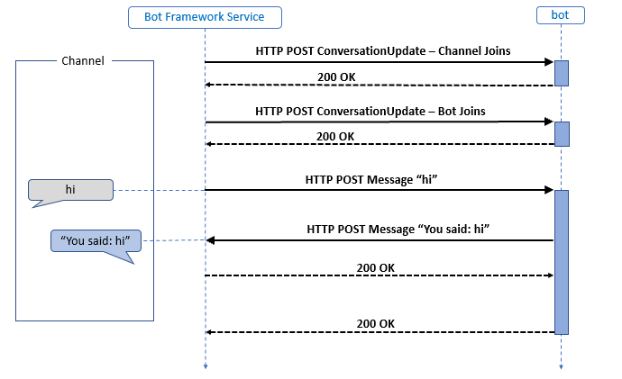

### Request Flow

Client Channel -> Bot Service -> Your App -> Bot Service -> Client Channel

## Notes

Why is this interesting? 
- Telemetry: a 200 request doesn't guarantee success, only that the message began processing
- Debugging: 
    - Requests cannot be sent directly to the bot app, they must be sent to bot service.
    - The emulator is able to communicate with your locally hosted bot because it hosts an emulated bot service server. It is the only channel that can talk to your bot without going through a real Azure Bot Service. This includes the web chat channel running in a locally hosted web app.
    - Scenarios:
        - Testing your app running locally with a live client (web chat). You can use ngrok to create
        - Running the emulator against a bot hosted on the web (i.e. not locally). When using a web app hosted bot, the emulator will automatically run ngrok and publishes the the port that it uses to listen for chat responses coming back from your app.
- Load testing: If you want to load test your bot, Microsoft's guidance is to run a mock bot service/channel server application that they have a github repo for. 

Microsoft Documentation
- https://docs.microsoft.com/en-us/azure/bot-service/bot-service-debug-emulator?view=azure-bot-service-4.0
- https://blog.botframework.com/2017/06/19/load-testing-a-bot/